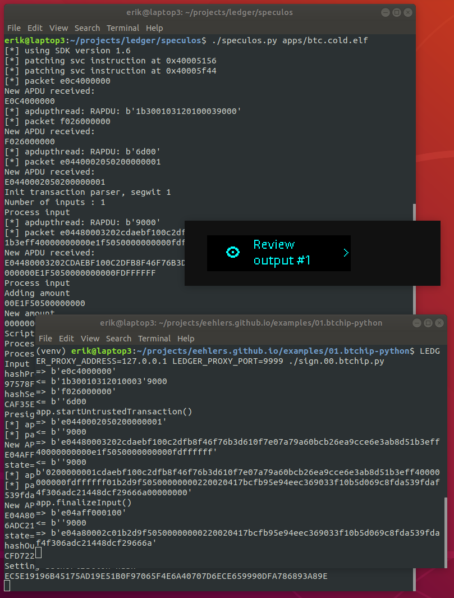

# Programming Ledger #1 - Setup

This article provides an introduction to writing code for the Ledger.  The ledger platform is already well documented.  This article provides pointers to the ledger documentation, and offers additional information which may be helpful to someone who is just starting out.

A followup to this article may be found at the following link: [Programming Ledger #2 - Bitcoin Message Signing](./ledger.01.message.md)

## Terminology

The Ledger documentation uses a lot of acronyms, and occasionally you will come across an acronym before you have seen its definition.  Here is a list of terms that you are likely to encounter, and their meanings:

- APDU - Application Protocol Data Unit.  Command/response packet exchanged between device and host.
- BOLOS - Blockchain Open Ledger Operating System.  The OS for ledger devices.
- BAGL - BOLOS Application Graphics Library.  Toolkit for building GUIs.
- HAL - Hardware Abstraction Layer.
- MCU - STM32 microcontroller.  Acts as router between Secure Element and peripherals.
- MPU - Memory Protection Unit.  Regulates access to flash memory.
- SE - Secure Element.  Stores secrets.
- SEPROXYHAL or SEPH - SE-MCU link protocol.  Governs communication with the Secure Element.
- HID - Human Interface Device.

## Documentation

The ledger documentation is here: [Ledger Documentation Hub](https://ledger.readthedocs.io/en/latest/index.html).  Of particular interest for someone developing for the platform is the document [Application Debug](https://ledger.readthedocs.io/en/latest/userspace/debugging.html) which explains how to install a debug copy of the MCU firmware so that you can see output from the `PRINTF` macro.

## blue-loader-python

*This package contains Python tools to communicate with Ledger Blue, Nano S and Nano X and manage applications life cycle.*  Here is the repo: [https://github.com/LedgerHQ/blue-loader-python](https://github.com/LedgerHQ/blue-loader-python).

You need to install the prerequisites and set up the udev rules.  If you take a local clone of the repo, you can create a virtual environment like so:

    python -m venv venv
    source venv/bin/activate
    cd /home/projects/blue-loader-python
    pip install .

Here is the command to generate a list of the apps that have been installed to a connected Nano S (which must be open to the Dashboard, i.e. not currently running any app):

    (venv) erik@laptop3:~/projects/blue-loader-python$ python -m ledgerblue.listApps --targetId 0x31100004
    [{'flags': 822868, 'hash_code_data': b'Z\x13\t\x07\xb6hB\x86;x\x88\x111\x05\xd2k\x97W\xed\xd4\xa5\x94\xc2C~\x84%\xb0\xd5K\xac\x83', 'hash': b'v\x95Z\x82\x1a\x8a\xa0J\xcbH :}\xf7\x11;\xfd\x1a\x0fG\x95R\xd9\t\x8e\x03/\xa9\xb1\x91p\x18', 'name': 'Bitcoin'}]

## btchip-python

*Python communication library for Ledger Hardware Wallet products*.  Here is the repo: [https://github.com/LedgerHQ/btchip-python](https://github.com/LedgerHQ/btchip-python).

If you take a local clone of the repo, you can create a virtual environment like so:

    python -m venv venv
    source venv/bin/activate
    pip install ecdsa
    cd /home/projects/btchip-python
    pip install .

If you want to do a quick sanity check to confirm that `btchip-python` is correctly installed, and talking to the ledger, you can use the following script to accomplish that:

    btchip-python/samples/getFirmwareVersion.py

In spite of its name, the script does not get the firmware version (which on my device is currently `1.6.0`).  Rather it gets the version number of the ledger bitcoin app (which on my device is currently `1.3.18`).  Before you run the command, you must ensure that the device is connected, and that the `Bitcoin` app is running:

    (venv) erik@laptop3:~/projects/btchip-python/samples$ python getFirmwareVersion.py 
    => b'e0c4000000'
    <= b'1b30010312010003'9000
    => b'f026000000'
    <= b''6d00
    => b'e0c4000000'
    <= b'1b30010312010003'9000
    1.3.18

Here is a script that sends a transaction to the ledger for signature: [sign.00.btchip.py](examples/01.btchip-python/sign.00.btchip.py)

The transaction that gets signed looks like this: [psbt.txt](examples/02.hwi/psbt.txt).

## HWI

*The Bitcoin Hardware Wallet Interface is a Python library and command line tool for interacting with hardware wallets. It provides a standard way for software to work with hardware wallets without needing to implement device specific drivers. Python software can use the provided library (hwilib). Software in other languages can execute the hwi tool.*

Here is the repo: [https://github.com/bitcoin-core/HWI](https://github.com/bitcoin-core/HWI)

If you take a local clone of the repo, you can create a virtual environment like so:

    python -m venv venv
    source venv/bin/activate
    cd /home/projects/HWI
    pip install .

Here is the command to list connected devices:

    (venv) erik@laptop3:~/projects/HWI$ ./hwi.py enumerate
    [{"type": "ledger", "model": "ledger_nano_s", "path": "0001:0028:00", "fingerprint": "ceee3b70", "needs_pin_sent": false, "needs_passphrase_sent": false}]

This command extracts the xpub from the Nano S:

    (venv) erik@laptop3:~/projects/HWI$ ./hwi.py -t ledger -d 0001:0028:00 getmasterxpub
    {"xpub": "xpub6Ckt69XEANUEN1gALQFSmXFkLrHBH7NbADAkCmDYtgKxcACXNHsGWCJRicryAYXyyti1jNJER9fuVmymscDsgC9VKjvu1ZrTWCcidDNfo3K"}

HWI ships with a copy of the btchip-python source code, in this directory:

    HWI/hwilib/devices/btchip

HWI's copy of btchip-python is way out of date, and has been modified to remove lines of code that are not called by HWI.  This is fine if you are using HWI out of the box.  However I wanted to use HWI in combination with newer features in btchip-python.  I overwrote HWI's copy of btchip-python with a complete snapshot of the latest version of btchip-python.  Nothing bad has happened so far.  So you could probably do the same.

Above we provided a script to sign a transaction using btchip-python.  Here is a script to do the same thing using HWI: [sign.01.hwi.py](examples/02.hwi/sign.01.hwi.py).

The HWI script is much shorter.  In fact, HWI calls btchip-python and invokes all of the commands that appear in the previous script.  I actually created the HWI script first.  In order to capture the inputs to btchip-python, I added the following debugging lines to script `hwilib/devices/ledger.py`, in function `sign_tx()`, near line 251:

    if has_segwit:
        import pprint
        print(f"segwit_inputs={pprint.pformat(segwit_inputs)}")
        print(f"tx_bytes={tx_bytes}")
        print(f"script_code={script_codes[0]}")
        print(f"path={all_signature_attempts[0][0][0]}")
        # Process them up front with all scriptcodes blank
        blank_script_code = bytearray()

## ledger-app-btc

The ledger-app-btc project contains the C source code for the ledger bitcoin app.  Here is the repo: [https://github.com/LedgerHQ/ledger-app-btc](https://github.com/LedgerHQ/ledger-app-btc).

In order to compile `ledger-app-btc`, you need to set up the toolchain and SDK as explained in the ledger documentation mentioned earlier: [Getting Started](https://ledger.readthedocs.io/en/latest/userspace/getting_started.html).

Here is the repo for the SDK: [https://github.com/LedgerHQ/nanos-secure-sdk](https://github.com/LedgerHQ/nanos-secure-sdk).  The SDK does not need to be built.  Be sure to check out of the SDK repo the branch that corresponds to the version of the ledger firmware that you are targeting.

The commands to build the app and install it to the device would look something like:

    export BOLOS_ENV=/home/projects/bolos-devenv
    export BOLOS_SDK=/home/projects/nanos-secure-sdk
    COIN=bitcoin make load

## Speculos

*The goal of this project is to emulate Ledger Nano and Ledger Blue apps on standard desktop computers, without any hardware device.*  Here is the repo: [https://github.com/LedgerHQ/speculos](https://github.com/LedgerHQ/speculos)

Once you get it built, you start it like so:

    ./speculos.py apps/btc.elf

If you want to emulate a device using a specific seed, you do it like this:

    export SEED="witch collapse practice feed shame open despair creek road again ice least"
    ./speculos.py --seed "$SEED" apps/btc.elf

To direct a command to the emulator rather than to a physical device, prepend the command with `LEDGER_PROXY_ADDRESS=127.0.0.1 LEDGER_PROXY_PORT=9999`.  Here is the example `btchip-python` command that we ran earlier, sent to the emulator:

    (venv) erik@laptop3:~/projects/ledger/btchip-python.ledger/samples$ LEDGER_PROXY_ADDRESS=127.0.0.1 LEDGER_PROXY_PORT=9999 python getFirmwareVersion.py
    => b'e0c4000000'
    <= b'1b30010312010003'9000
    => b'f026000000'
    <= b''6d00
    => b'e0c4000000'
    <= b'1b30010312010003'9000
    1.3.18

Earlier we provided a `btchip-python` script to send a TX to the ledger for signature: [sign.00.btchip.py](examples/01.btchip-python/sign.00.btchip.py).  Now you can run that script against the emulator:

I made a little tweak to HWI to allow it to support the ledger emulator:

https://github.com/eehlers/HWI/commit/f5a13cb1756415d7f97d918d3ba8eabf78fd6717

Earlier we saw an HWI script that sends a TX to the ledger for signature: [sign.01.hwi.py](examples/02.hwi/sign.01.hwi.py).  Once you apply my tweak to your copy of HWI, you can run the script against the emulator like this:

    LEDGER_PROXY_ADDRESS=127.0.0.1 LEDGER_PROXY_PORT=9999 python sign.01.hwi.py

## APDUs

The client process (e.g. a Python script on your laptop) communicates with the ledger by exchanging APDUs (Application Protocol Data Units).  This is explained in more detail in the ledger documentation that was linked earlier: [Application Structure and I/O](https://ledger.readthedocs.io/en/latest/userspace/application_structure.html).

*The command / response scheme used to address the device is similar to the ISO/IEC 7816-4 smartcard protocol. Each command / response packet is called an APDU. The application is driven by a never-ending APDU interpretation loop called straight from the application main function.*

Ledger provide a hello world app called [Boilerplate](https://github.com/LedgerHQ/ledger-app-boilerplate) and that project includes a document which gives additional information regarding APDUs: [boilerplate application : Common Technical Specifications](https://github.com/LedgerHQ/ledger-app-boilerplate/blob/master/doc/api.asc)

When you run a `blue-loader-python` command, you can pass the `--apdu` argument to see the APDUs that are exchanged by the client and the device.  Here is the `listApps` command that we ran earlier, now with the `--apdu` argument:

    (venv) erik@laptop3:~$ python -m ledgerblue.listApps --targetId 0x31100004 --apdu
    HID => e0de000000
    HID <= 0154000c8e545a130907b66842863b7888113105d26b9757edd4a594c2437e8425b0d54bac8376955a821a8aa04acb48203a7df7113bfd1a0f479552d9098e032fa9b19170180e426974636f696e205265674e65749000
    [{'flags': 822868, 'hash_code_data': b'Z\x13\t\x07\xb6hB\x86;x\x88\x111\x05\xd2k\x97W\xed\xd4\xa5\x94\xc2C~\x84%\xb0\xd5K\xac\x83', 'hash': b'v\x95Z\x82\x1a\x8a\xa0J\xcbH :}\xf7\x11;\xfd\x1a\x0fG\x95R\xd9\t\x8e\x03/\xa9\xb1\x91p\x18', 'name': 'Bitcoin'}]
    HID => e0df000000
    HID <= 9000

This time it prints out the APDUs that pass back and forth between the client and the device.  You can see that the `listApps` command sends APDU `e0de000000`.  You can use the `runScript` command to send a raw APDU.  Here we run the same command as above, this time passing the APDU to `runScript` instead of calling `listApps`:

    (venv) erik@laptop3:~$ echo 'e0de000000' | python -m ledgerblue.runScript --apdu
    HID => e0de000000
    HID <= 0154000c8e545a130907b66842863b7888113105d26b9757edd4a594c2437e8425b0d54bac8376955a821a8aa04acb48203a7df7113bfd1a0f479552d9098e032fa9b19170180e426974636f696e205265674e65749000
    <= Clear bytearray(b'\x01T\x00\x0c\x8eTZ\x13\t\x07\xb6hB\x86;x\x88\x111\x05\xd2k\x97W\xed\xd4\xa5\x94\xc2C~\x84%\xb0\xd5K\xac\x83v\x95Z\x82\x1a\x8a\xa0J\xcbH :}\xf7\x11;\xfd\x1a\x0fG\x95R\xd9\t\x8e\x03/\xa9\xb1\x91p\x18\x0eBitcoin')

The first byte of the APDU (`0xE0`) is always the same.  The second byte indicates which function you want to run.

For example, consider the btchip-python script that we ran earlier: `getFirmwareVersion.py`.  In the output we saw that it was passing APDU `e0c4000000`.  Here we pass that same APDU to the emulator using `runScript`:

    echo 'e0c4000000' | LEDGER_PROXY_ADDRESS=127.0.0.1 LEDGER_PROXY_PORT=9999 python -m ledgerblue.runScript --apdu

The second byte of the APDU, `0xC4`, identifies the function that we want to run.  The meaning of `0xC4` is defined in file `ledger-app-btc/include/btchip_apdu_constants.h`:

    #define BTCHIP_INS_GET_FIRMWARE_VERSION 0xC4

To get the name of the corresponding C function, consult the relevant array in file `ledger-app-btc/src/btchip_rom_variables.c`:

    unsigned char const DISPATCHER_INS[] = {
        BTCHIP_INS_SETUP,                    // btchip_apdu_setup,
        BTCHIP_INS_VERIFY_PIN,               // btchip_apdu_verify_pin,
        BTCHIP_INS_GET_OPERATION_MODE,       // btchip_apdu_get_operation_mode,
        BTCHIP_INS_SET_OPERATION_MODE,       // btchip_apdu_set_operation_mode,
        BTCHIP_INS_GET_WALLET_PUBLIC_KEY,    // btchip_apdu_get_wallet_public_key,
        BTCHIP_INS_GET_TRUSTED_INPUT,        // btchip_apdu_get_trusted_input,
        BTCHIP_INS_HASH_INPUT_START,         // btchip_apdu_hash_input_start,
        BTCHIP_INS_HASH_SIGN,                // btchip_apdu_hash_sign,
        BTCHIP_INS_HASH_INPUT_FINALIZE_FULL, // btchip_apdu_hash_input_finalize_full,
        BTCHIP_INS_SIGN_MESSAGE,             // btchip_apdu_sign_message,
        BTCHIP_INS_GET_RANDOM,               // btchip_apdu_get_random,
        BTCHIP_INS_GET_FIRMWARE_VERSION,     // btchip_apdu_get_firmware_version,
        BTCHIP_INS_SET_ALTERNATE_COIN_VER, // btchip_apdu_set_alternate_coin_version
        BTCHIP_INS_GET_COIN_VER,           // btchip_apdu_get_coin_version
    };

There you can see that `BTCHIP_INS_GET_FIRMWARE_VERSION` maps to function `btchip_apdu_get_firmware_version()`.  Indeed if you run the command above it calls `btchip_apdu_get_firmware_version()`.  As mentioned previously, that function doesn't actually return the version number of the firmware, it returns the version number of the bitcoin app.

## Debugging

This is the command to start the emulator in debug mode:

    ./speculos.py -d apps/btc.elf & ./tools/debug.sh apps/btc.elf

Processing breaks in the `main()` function, so that you can set your breakpoints before resuming the processing.

Using the default settings, the debugger does not work very well.  This is because, by default, the binary is built with optimizations, causing the debugger to skip over certain lines, and preventing it from seeing any variables that have been optimized away.  For better results in the debugger, you can edit the `Makefile` and turn optimizations off:

    CFLAGS += -O0

## Notes

When you use vi and ctags in combination, you can place the cursor on an identifier and hit `Ctrl-]` to hop to its definition.  For an explanation of how to set up ctags for the ledger development environment, refer to this page: [ctags](ctags.md).

