# Programming Ledger #2 - Bitcoin Message Signing

This article explore's ledger's functionality for bitcoin message signing.  This article follows on from [Programming Ledger #1 - Setup](./ledger.00.setup.md).

## Bitcoin Message Signing

Bitcoin message signing lets you sign a message using one of the private keys in your wallet.  It's a way of proving that you control any funds at the corresponding address.

Suppose that you pay a vendor and they ask you to prove that the money came from you.  You could generate a message asserting that the payment originated from you.  You would sign that message using the private key corresponding to the address from which you paid the funds, proving that you control that address.

Any message that you sign must always be explicit, including at least your name (or other identifier), the date and time, the recipient's name (or other identifier), and the purpose of the message.  Signing a vague message is dangerous.  For example, suppose you sign the message "I approve".  Someone else could take that message and the signature and falsely claim control over the corresponding key, in some context completely unrelated to the circumstances in which you signed the original message.

Before signing the message, bitcoin prepends to it the magic string "Bitcoin Signed Message:".  This is to prevent someone from tricking you into signing something that you shouldn't, such as a transaction.

Normally, in order to verify a signature cryptographically, you would need the message, the signature, and the public key.  However, the ECDSA cryptography underlying bitcoin supports derivation of the public key given the message and the signature.  Bitcoin exploits this feature of ECDSA and hence bitcoin can verify a signature using only the message, the public key is not required.  Usually you pass to the verification function the address against which the message was signed, the function derives the public key and confirms that it matches the given address.

## Seed Phrase

The examples below use the following seed phrase:

    barely sun snack this snack relief pipe attack disease boss enlist lawsuit

If you want to follow along, then at some point you will need to fire up a ledger with that seed phrase.  Either you can configure a ledger using the value above, or you can change that value to match the one for your ledger.

## Electrum

Ledger's bitcoin message signing functionality is somewhat nonstandard.  So before we look at that, let's generate a signature in Electrum, whose functionality (at least in this regard) is standard.

Create a new wallet.

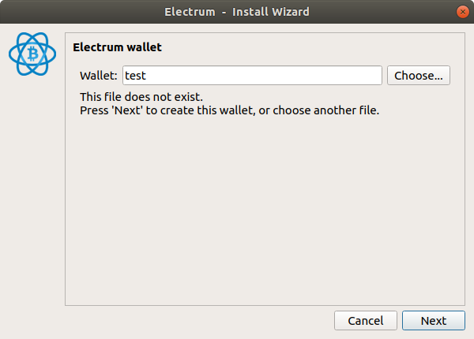

Choose "Standard wallet".

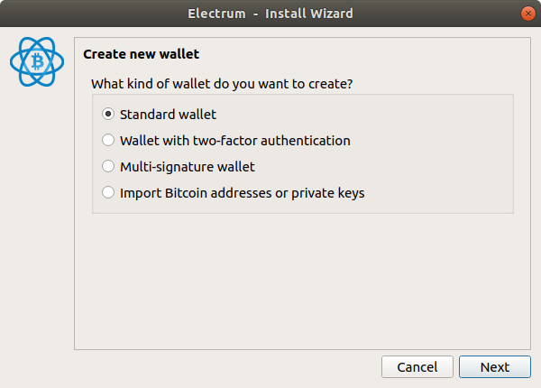

Choose "I already have a seed".

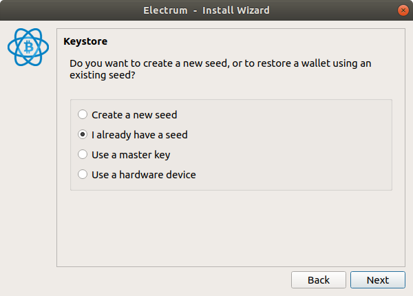

Under Options, choose BIP39.  Enter the seed.

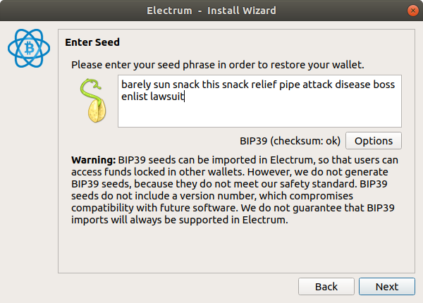

Choose "legacy".

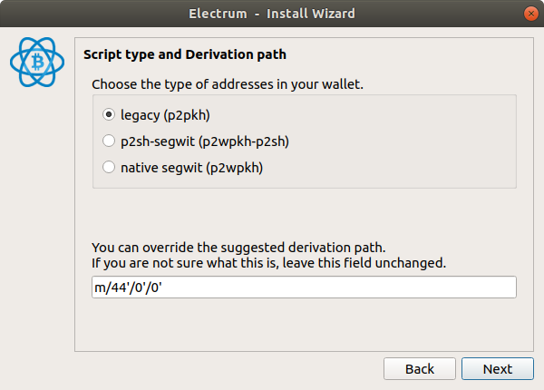

Leave the password blank.

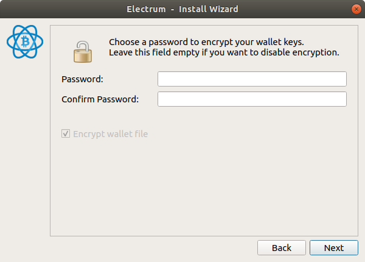

Voilà, the wallet.

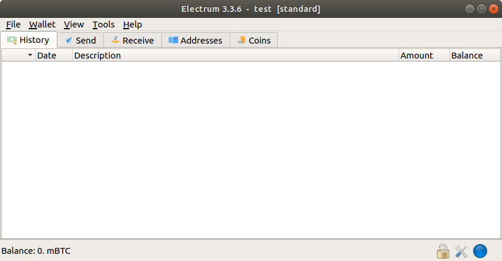

Click the "Addresses" tab.  Right click on the first address and click "Sign/verify message".

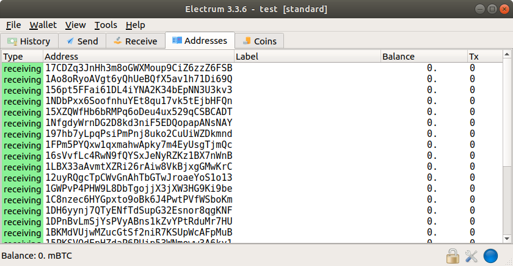

Enter the message "hello world" (lowercase, no quotes).  Click "Sign".  The signature appears below.

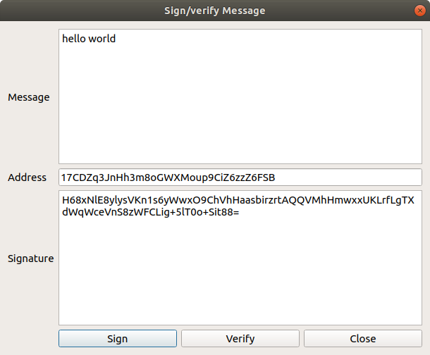

Your counterparty can enter that message, signature, and address into any app that supports bitcoin message signing, and verify the message, thereby confirming that you do indeed control the relevant private key.

## Ledger

Right.  Now let's try to write a Python script to generate the same signature on the ledger.

In the [btchip-python](https://github.com/LedgerHQ/btchip-python) repo, at the path below, there is a script called `testMessageSignature.py`:

    btchip-python/tests/testMessageSignature.py

I have not been able to get that script to work.  It has not been upgraded for python 3 but even when I run it in python 2 it does not seem to work.

Instead I cannibalized the essential code from that script into the script below, which works perfectly well under python 3: [testMessageSignature2.py](examples/01.btchip-python/testMessageSignature2.py)

In order to follow along, you either need to change the test seed phrase to match the one from your ledger, or you need to configure a ledger with the test seed phrase.  To do that, you first do a factory reset on the device.  Then you start it up in recovery mode (hold down the right button, keep it depressed, plug in the device, then when "Recovery" appears on the screen you can release the button).  Then using `ledgerblue` (which we set up in the previous tutorial), you run the following command:

    python3 -m ledgerblue.hostOnboard --id 0 --passphrase "" --pin 0000 --prefix "" --words "barely sun snack this snack relief pipe attack disease boss enlist lawsuit"

Now you can run the script.  This is what the output looks like:

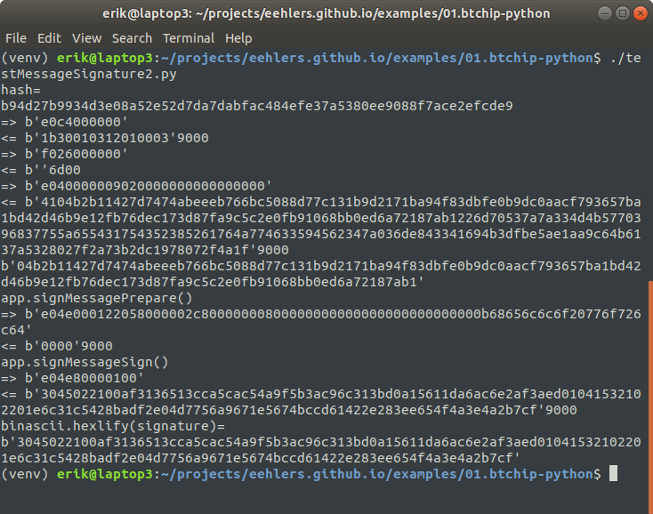

First the script prints out a hash of the message:

    b94d27b9934d3e08a52e52d7da7dabfac484efe37a5380ee9088f7ace2efcde9

Then the script asks the device to sign the message.  The device displays the above hash, this is to make sure that you are signing the right thing.  Then it prompts you to sign the message.  This is the signature we get back:

    3045022100af3136513cca5cac54a9f5b3ac96c313bd0a15611da6ac6e2af3aed01041532102201e6c31c5428badf2e04d7756a9671e5674bccd61422e283ee654f4a3e4a2b7cf

So, that's weird.  It doesn't look anything like the signature we got from Electrum.  What happened?

HWI to the rescue.

## HWI

[HWI](https://github.com/bitcoin-core/HWI) supports a bitcoin message signing function, which HWI can run on all of the devices that it supports, including ledger, which HWI accesses using its own copy of btchip-python.  So if we run HWI's bitcoin message signing function against the ledger, we should get back the same signature that was returned by btchip-python, right?  Let's try it.

Here is a script to call HWI's bitcoin message sign function: [messagesign.01.hwi.py](examples/02.hwi/messagesign.01.hwi.py)

As before, this script is shorter than the equivalent script for  btchip-python.  Connect the ledger and run the script.  Here's what you get:

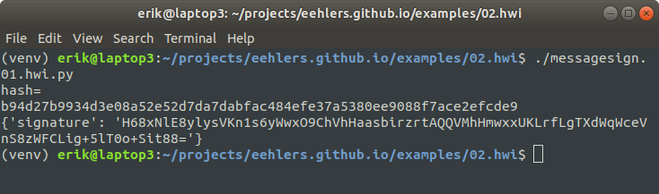

Again the script prints out a hash of the message.  Then HWI asks the ledger to sign the message.  The device displays the relevant address.  Then it behaves exactly as it did in the previous example - it displays the message hash, and asks you to confirm that you want to sign the message.

This is the signature we get back:

    H68xNlE8ylysVKn1s6yWwxO9ChVhHaasbirzrtAQQVMhHmwxxUKLrfLgTXdWqWceVnS8zWFCLig+5lT0o+Sit88=

Now that's weird.  Even though HWI calls btchip-python, the signature that we got back from HWI does not match the one that we got from btchip-python.  In fact it matches the one from Electrum.  What happened?

The answer is in the code.  Let's look in file `hwilib/devices/ledger.py`, at function `sign_message()`:

```python
# Must return a base64 encoded string with the signed message
# The message can be any string
@ledger_exception
def sign_message(self, message, keypath):
    if not check_keypath(keypath):
        raise BadArgumentError("Invalid keypath")
    message = bytearray(message, 'utf-8')
    keypath = keypath[2:]
    # First display on screen what address you're signing for
    self.app.getWalletPublicKey(keypath, True)
    self.app.signMessagePrepare(keypath, message)
    signature = self.app.signMessageSign()

    # Make signature into standard bitcoin format
    rLength = signature[3]
    r = signature[4: 4 + rLength]
    sLength = signature[4 + rLength + 1]
    s = signature[4 + rLength + 2:]
    if rLength == 33:
        r = r[1:]
    if sLength == 33:
        s = s[1:]

    sig = bytearray(chr(27 + 4 + (signature[0] & 0x01)), 'utf8') + r + s

    return {"signature": base64.b64encode(sig).decode('utf-8')}
```

What's going on there?  HWI asks btchip-python to get the signature:

    signature = self.app.signMessageSign()

The value of `signature` is the same as the value that we ourselves got back earlier when we called btchip-python directly:

    3045022100af3136513cca5cac54a9f5b3ac96c313bd0a15611da6ac6e2af3aed01041532102201e6c31c5428badf2e04d7756a9671e5674bccd61422e283ee654f4a3e4a2b7cf

But then HWI unpacks that value, and reformats it into the same value that was generated by electrum:

    H68xNlE8ylysVKn1s6yWwxO9ChVhHaasbirzrtAQQVMhHmwxxUKLrfLgTXdWqWceVnS8zWFCLig+5lT0o+Sit88=

It turns out that the value returned by btchip-python is DER-encoded.  Which is odd, normally you would use DER encoding for the signature of a transaction, but not for the signature of a bitcoin message.  HWI decodes the signature and then converts it into the standard format.

## 0x30 and 0x31

In fact, ledger's DER encoding is nonstandard too.  DER encoded values always have `0x30` as the first byte, it's part of the standard.  But bitcoin message signatures that come back from the ledger will have `0x31` as the first byte half of the time.  An explanation for this appears in the [SDK](https://github.com/LedgerHQ/nanos-secure-sdk) source code, in file `nanos-secure-sdk/include/lcx_ecdsa.h`, in the comments for function `cx_ecdsa_sign`:

```C
/**
 * Sign a hash message according to ECDSA specification.
 *
 * @param [in] pvkey
 *   A private ecfp key fully inited with 'cx_ecfp_init_private_key'
 *
 * @param [in] mode
 *   Crypto mode flags. See above.
 *   Supported flags:
 *     - CX_RND_TRNG
 *     - CX_RND_RFC6979
 *
 * @param [in] hashID
 *  Hash identifier used to compute the input data.
 *  This parameter is mandatory for rng of type CX_RND_RFC6979.
 *
 * @param [in] hash
 *   Input data to sign.
 *   The data should be the hash of the original message.
 *   The data length must be lesser than the curve size.
 *
 * @param [in] hash_len
 *   Length of input to data.
 *
 * @param [out] sig
 *   ECDSA signature encoded as TLV:  30 L 02 Lr r 02 Ls s
 *
 * @param [out] info
 *   Set CX_ECCINFO_PARITY_ODD if Y is odd when computing k.G
 *
 * @return
 *   Full length of signature
 *
 * @throws INVALID_PARAMETER
 */
CXCALL int cx_ecdsa_sign(const cx_ecfp_private_key_t WIDE *pvkey PLENGTH(
                             scc__cx_scc_struct_size_ecfp_privkey__pvkey),
                         int mode, cx_md_t hashID,
                         const unsigned char WIDE *hash PLENGTH(hash_len),
                         unsigned int hash_len,
                         unsigned char *sig PLENGTH(sig_len),
                         unsigned int sig_len,
                         unsigned int *info PLENGTH(sizeof(unsigned int)));
```

It's in the description for the return value: *Set CX_ECCINFO_PARITY_ODD if Y is odd when computing k.G*.  So that's it.  When Y is odd, ledger overwrites the first byte of the DER signature with `0x31`.  Presumably that's meant to help a consumer of the signature to identify the public key to which the signature relates.

# Verification

If you take the signature that HWI returns in standard format, you can pass that for verification to any app that supports bitcoin message signing, e.g. electrum.  What if you want to verify a signature on the ledger?

As far as I can tell, ledger does not supply any python scripts to verify a bitcoin message signature, nor does `ledger-app-btc` implement a verification function.  However the [SDK](https://github.com/LedgerHQ/nanos-secure-sdk) does include a function `cx_ecdsa_verify()` and you can call that.

Suppose you have the message, the public key against which it was signed, and the signature.  Before you can verify the signature, you must first prepend to the message the magic string mentioned above, and take the hash of the result.  Ledger already contains the code to do that, in the place where it signed the message (`btchip_apdu_sign_message()`), so you just need to copy and paste that functionality into your new verification function, and then call `cx_ecdsa_verify()`.

Here is an example function.  When I call this function with the inputs from our example, it returns true!
```c
int verify(
        cx_sha256_t *messageHash,
        unsigned char *message,
        unsigned char messageLength,
        const cx_ecfp_public_key_t *pukey,
        unsigned char *sig,
        uint8_t siglen) {
    cx_sha256_init(messageHash);
    unsigned char chunkLength = btchip_context_D.coinIdLength + SIGNMAGIC_LENGTH;
    cx_hash(&(*messageHash).header, 0,
        &chunkLength, 1, NULL, 0);
    cx_hash(&(*messageHash).header, 0,
        btchip_context_D.coinId,
        btchip_context_D.coinIdLength, NULL, 0);
    cx_hash(&(*messageHash).header, 0,
        (unsigned char *)SIGNMAGIC, SIGNMAGIC_LENGTH, NULL, 0);
    cx_hash(&(*messageHash).header, 0,
        &messageLength, 1, NULL, 0);
    cx_hash(&(*messageHash).header, 0,
        btchip_context_D.transactionSummary.authorizationHash, 32, NULL, 0);
    unsigned char hash[32];
    cx_hash(&(*messageHash).header, CX_LAST, hash,
        0, hash, 32);
    cx_sha256_init(messageHash);
    cx_hash(&(*messageHash).header, CX_LAST, hash,
        32, hash, 32);
    return cx_ecdsa_verify(pukey, CX_LAST, CX_SHA256, hash, 32, sig, siglen);
}
```

The signature that you pass to this function must be in DER format, such as a signature generated by the ledger.  If ledger changed the first byte from `0x30` to `0x31`, you have to change it back to `0x30` before passing it to `cx_ecdsa_verify()`, otherwise verification will fail.
