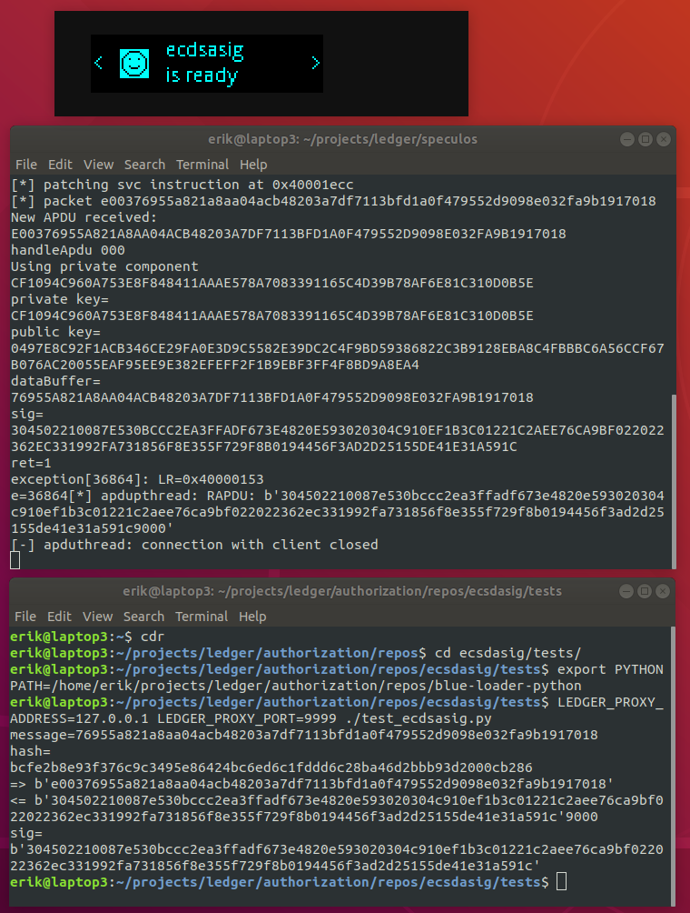

# Programming Ledger #3 - ECDSA Signatures

Normally you use your ledger to sign bitcoin transactions.  You can also use it to sign bitcoin messages, as explained in the previous article, [Programming Ledger #2 - Bitcoin Message Signing](./ledger.01.message.md).  Another possibility is to use the ledger to generate ECDSA signatures for arbitrary messages which are neither transactions nor bitcoin messages.

Normally you would not use a ledger in this way.  When signing a transaction, you generate an ECDSA signature of the hash of the transaction - but you don't send the hash of the transaction to the ledger.  You send to the ledger the transaction itself.  The ledger parses the transaction, validates it, and asks you to confirm all of the relevant properties of the transaction before signing.  All of this validation is very important to ensure that you don't sign anything you shouldn't.

If you want to sign something other than a transaction, usually you sign a bitcoin message.  In this case, the ledger prepends to the message some hard coded text, this ensures that you don't inadvertently sign something that you shouldn't, such as a transaction.

So normally you would not generate an ECDSA signature of some arbitrary value.  However, there might be cases where your security model calls for it.  For example, we participated in a project where a downstream party required an ECDSA signature of an arbitrary hash, and they were not set up to verify a bitcoin message signature.  Using a ledger to generate the signature is very convenient, because the secrets on the ledger are secure, even if the host machine is compromised.  This article presents an app that we implemented for the ledger to sign an arbitrary hash.  This app must never be installed onto a ledger which is being used to store funds.

## ecdsasig

`ecdsasig` is a simple ledger app which signs an arbitrary value.  The procedure to sign a message using `ecdsasig` is as follows:

- Configure a ledger with your secret.
- Install to that ledger the app `ecdsasig`.
- Connect your ledger to the host machine and sign a message.

## Configuring a ledger

You should acquire a Nano S that will be dedicated to the purpose of generating signatures.  Ensure that the device is running the latest version of the ledger firmware (`1.6.0` at the time of this writing).  If the device is on an older version of the firmware, upgrade it using [Ledger Live](https://support.ledger.com/hc/en-us/articles/360006395553).

Then do a factory reset on the device (`Settings | Security | Reset all`).

Then initialize the device with your secret.  Restart the device in recovery mode: with the device disconnected, press and hold the right button, connect the device, wait until the device displays the word "Recovery", then release the button.  Now you can initialize the device:

    python -m ledgerblue.hostOnboard --id 0 --passphrase "" --pin 0000 --prefix "" --words "barely sun snack this snack relief pipe attack disease boss enlist lawsuit"

## Installing `ecdsasig`

`ecdsasig` is an app which generates an ECDSA signature of an arbitrary message.  The `ecdsasig` app is headless, there is no user interaction, apart from opening the app initially.  At present `ecdsasig` is hard coded to generate a signature using the key found at derivation path `m/42h/0h`.  If necessary `ecdsasig` could easily be enhanced to parameterize this value.

Here is the repo for `ecdsasig`: <https://github.com/eehlers/ecsdasig>

Clone the repo.  If you haven't already set up the BOLOS development environment, you can do so by following the instructions here: [Getting Started](https://ledger.readthedocs.io/en/latest/userspace/getting_started.html)

Now you can build `ecdsasig` and install it to your signing ledger.  With the device connected (in normal mode), execute the following commands:

```bash
export BOLOS_ENV=/home/projects/ledger/bolos-devenv
export BOLOS_SDK=/home/projects/ledger/nanos-secure-sdk
make load
```

## Testing `ecdsasig`

The `ecdsasig` repo includes a `tests` directory with a couple of scripts that you can use to test the app.  `test_example.py` is a hello world script from the `boilerplate` app from which `ecdsasig` is derived.  `test_ecdsasig_offline.py` generates a signature in software using [ecpy](https://github.com/cslashm/ECPy).  To run `test_ecdsasig.py`, connect your ledger to the laptop and open the `ecdsasig` app.  The script sends a message to the device and gets back a signature.

## Running `ecdsasig` in the emulator

You can run `ecdsasig` in the emulator like so:
```bash
# from the build directory
cp bin/app.elf ~/projects/ledger/speculos/apps/ecdsasig.elf
# from the speculos directory
export SEED="barely sun snack this snack relief pipe attack disease boss enlist lawsuit"
./speculos.py --seed "$SEED" apps/ecdsasig.elf
# from the tests directory
python -m venv venv
source venv/bin/activate
cd /home/projects/ledger/blue-loader-python
pip install .
cd -
LEDGER_PROXY_ADDRESS=127.0.0.1 LEDGER_PROXY_PORT=9999 ./test_ecdsasig.py
```


