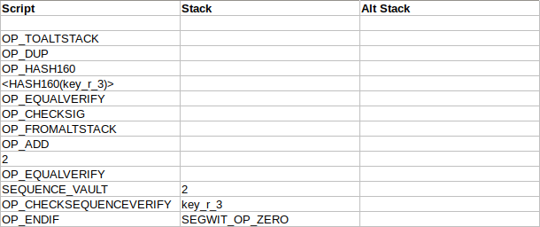

# Article #5 - Miniscript - Introduction

[Miniscript](http://bitcoin.sipa.be/miniscript/) _is a language for writing (a subset of) Bitcoin Scripts in a structured way, enabling analysis, composition, generic signing and more._

This document provides some observations that might be helpful to someone first getting to grips with Miniscript.

## Sources

Below is a list of some of the major resources relating to Miniscript:

[Miniscript website](http://bitcoin.sipa.be/miniscript/) - This web page provides a specification for the language, and utilities for compiling and analyzing scripts.

[miniscript repo on github](https://github.com/sipa/miniscript) - _This repository contains a C++ implementation of Miniscript._

[rust-miniscript repo on github](https://github.com/apoelstra/rust-miniscript) - _Library for handling Miniscript, which is a subset of Bitcoin Script designed to support simple and general tooling._

[Crate miniscript](https://docs.rs/miniscript/0.12.0/miniscript/) - Online documentation for rust-miniscript.

Anybody interested in learning miniscript should start by reading the first link above, the language reference.  I will come back to that at the end of this document.  First let's take a quick look at the two libraries.

## C++ Implementation

Downloading and building this project is easy enough:

```bash
erik@laptop3:~/projects/eehlers.github.io/examples.04$ git clone https://github.com/sipa/miniscript.git
Cloning into 'miniscript'...
remote: Enumerating objects: 35, done.
remote: Counting objects: 100% (35/35), done.
remote: Compressing objects: 100% (20/20), done.
remote: Total 442 (delta 17), reused 27 (delta 15), pack-reused 407
Receiving objects: 100% (442/442), 299.35 KiB | 1.15 MiB/s, done.
Resolving deltas: 100% (275/275), done.
erik@laptop3:~/projects/eehlers.github.io/examples.04$ cd miniscript/
erik@laptop3:~/projects/eehlers.github.io/examples.04/miniscript$ make
g++ -O3 -g0 -Wall -march=native -flto -Ibitcoin bitcoin/util/strencodings.cpp bitcoin/util/spanparsing.cpp bitcoin/script/script.cpp bitcoin/script/miniscript.cpp compiler.cpp main.cpp -o miniscript
```
After you have built it, what are you supposed to do next?  It took me a bit of digging to figure it out.  The build creates in the current directory a binary called `miniscript`.  You invoke that from the command line, and then it sits there and waits for input.  It accepts two different kinds of input: 1) a policy, which it compiles into miniscript, or 2) a miniscript, which it analyzes.  This is the same functionality as that provided by the miniscript web site.

So if you already read the [miniscript web page](http://bitcoin.sipa.be/miniscript/) then you have there a selection of example policies from which to choose.  So you invoke the `miniscript` binary, you enter in a policy.  The binary outputs the resulting miniscript, and you enter that in order to analyze it:

```bash
erik@laptop3:~/projects/eehlers.github.io/examples.04/miniscript$ ./miniscript 
pk(key_1)
X    108.0000000000    35 c:pk(key_1) pk(key_1)
c:pk(key_1) pk(key_1)
      1 scriptlen=35 maxops=1 type=B safe=yes nonmal=yes dissat=unique input=1n output=1 miniscript=c:pk(key_1) pk(key_1)
```

Very cool.  However I had come here expecting to find a C++ library that I could call from my application in order to compile miniscript into script.  As far as I can tell, this project doesn't provide that.  It implements the miniscript compiler, but there is no API that you could call programatically, so if you wanted that then you would need to do some work.

The other project on the list, `rust-miniscript`, does provide such a library, so let's look at that.

## `rust-miniscript`

If you've never used rust before, it might take a while to figure out how to get this code to run.  Here are the commands to download, build, and test the library:

```bash
git clone https://github.com/apoelstra/rust-miniscript.git
cd rust-miniscript/
cargo build
cargo test
```
Now, in a separate directory, create a new project:

    cargo new rust-miniscript-example

Modify file `Cargo.toml` and add a dependency on bitcoin: [Cargo.toml](examples.04/Cargo.toml)

Overwrite file `src\main.rs` with the example from the documentation: [main.rs](examples.04/main.rs)

Now you can build and run the project like so:

```bash
erik@laptop3:~/projects/eehlers.github.io/examples.04/rust-miniscript-example$ cargo build
    Updating crates.io index
   Compiling cc v1.0.41
   Compiling bitcoin_hashes v0.7.6
   Compiling bech32 v0.7.2
   Compiling secp256k1-sys v0.1.2
   Compiling secp256k1 v0.17.2
   Compiling bitcoin v0.23.0
   Compiling miniscript v0.12.0
   Compiling rust-miniscript-example v0.1.0 (/home/erik/projects/eehlers.github.io/examples.04/rust-miniscript-example)
    Finished dev [unoptimized + debuginfo] target(s) in 16.05s
erik@laptop3:~/projects/eehlers.github.io/examples.04/rust-miniscript-example$ cargo run
    Finished dev [unoptimized + debuginfo] target(s) in 0.01s
     Running `target/debug/rust-miniscript-example`
Script(OP_HASH160 OP_PUSHBYTES_20 09ac5e1f13d2ce2f931e94faa314b064fffb82aa OP_EQUAL)
Script(OP_PUSHBYTES_33 020e0338c96a8870479f2396c373cc7696ba124e8635d41b0ea581112b67817261 OP_CHECKSIG OP_IFDUP OP_NOTIF OP_PUSHBYTES_33 020e0338c96a8870479f2396c373cc7696ba124e8635d41b0ea581112b67817261 OP_CHECKSIG OP_ENDIF)
32aAVauGwencZwisuvd3anhhhQhNZQPyHv
```

So here you have a library that you can use to compile Miniscript into Script.

## `OP_ZERO`, `OP_FALSE`, `OP_TRUE`

Later in this document we are going to see some example scripts.  Before we get to that, one quick aside.  Apparently segwit scripts do not recognize the standard operators for `OP_ZERO`, `OP_FALSE`, and `OP_TRUE`.  In order to get these scripts to work, we had to define special values for those operators.  Here are the relevant declarations in Python:

```python
SEGWIT_OP_ZERO = b''
SEGWIT_OP_FALSE = b''
SEGWIT_OP_TRUE = b'\x01'
```
On to the examples.

## Policy -> Miniscript -> Script

The [miniscript web page](http://bitcoin.sipa.be/miniscript/) includes a utility for converting a policy into miniscript, and compiling that into Script.  Let's try it out with a real world example.

Consider a vault wallet which is maintained by a group of custodians, each holding one key from a multisig keychain.  Once per month the custodians transfer the contents of the vault from one address to another in the same wallet, as proof of reserve.  A recovery keychain serves as protection in case of problems, e.g. if a custodian loses a key.  The recovery keychain can spend the contents of the vault only after a given relative block height is passed.

This is not a complete vault solution.  It is only a summary of one part of a larger solution, and it has been simplified for purposes of testing, but it's sufficient to use as a working example of miniscript.  Here is a handwritten locking script which implements the requirements of the vault:

    OP_IF,
        2, vault_pubkey1, vault_pubkey2, vault_pubkey3, 3, OP_CHECKMULTISIG,
    OP_ELSE,
        500, OP_CHECKSEQUENCEVERIFY, OP_DROP,
        2, recovery_pubkey1, recovery_pubkey2, recovery_pubkey3, 3, OP_CHECKMULTISIG,
    OP_ENDIF

Both the vault keychain and the recovery keychain are shown here as 2-of-3 multisig.  Here is the unlocking script for spending the funds with the vault keychain:

    SEGWIT_OP_ZERO, vault_sig1, vault_sig2, SEGWIT_OP_TRUE

You read the unlocking script from right to left.  The `SEGWIT_OP_TRUE` says that we want to follow the first branch of the `IF/THEN/ELSE` statement in the locking script.  Then we provide any two of the three required signatures - these must be sorted in the same sequence as the corresponding public keys from the locking script.  The final `SEGWIT_OP_ZERO` is required because of a bug in `OP_CHECKMULTISIG` which consumes an extra stack item.

Here is the unlocking script for the recovery keychain:

    SEGWIT_OP_ZERO, recovery_sig1, recovery_sig2, SEGWIT_OP_FALSE

This script only works after expiration of the time lock that is enforced in the locking script via `OP_CHECKSEQUENCEVERIFY`.

All well and good.  Now let's reimplement this script using miniscript.

Here is the policy that describes our locking script:

    or(thresh(2,pk(vault_pubkey1),pk(vault_pubkey2),pk(vault_pubkey3)),and(thresh(2,pk(recovery_pubkey1),pk(recovery_pubkey2),pk(recovery_pubkey3)),older(500)))

That says, "Either we will unlock the funds with the vault keychain, or we will unlock them with the recovery keychain, after the specified relative block height has been reached."

So if you plug that policy into the miniscript web site, this is the Script that comes out:

    2, recovery_pubkey1, recovery_pubkey2, recovery_pubkey3, 3, OP_CHECKMULTISIG, OP_NOTIF,
        2, vault_pubkey1, vault_pubkey2, vault_pubkey3, 3, OP_CHECKMULTISIG,
    OP_ELSE, 
        500, OP_CHECKSEQUENCEVERIFY,
    OP_ENDIF

That looks a bit different than the handwritten locking script.  In the handwritten script, we started with an `OP_IF`:  To spend with the vault keychain, you pass in `OP_TRUE`, and to spend with the recovery keychain, you pass in `OP_FALSE`.  This autogenerated script has no `OP_IF`.  It starts with the assumption that you are trying to spend with the recovery keychain.  If that attempt succeeds, the script then verifies that the timelock has been satisfied.  If the attempt fails, the script then lets you try again with the vault keychain.

How do you unlock this script?  This turns out to be one of the biggest challenges in working with miniscript.  Miniscript spits out these autogenerated locking scripts, but as far as I can tell it gives you no hints as to the syntax of the corresponding unlocking scripts.  Figuring them out can be quite a puzzle.

Here is the unlocking script for the vault keychain:

    SEGWIT_OP_ZERO, vault_sig1, vault_sig2, SEGWIT_OP_ZERO, SEGWIT_OP_ZERO, SEGWIT_OP_ZERO

The first two `SEGWIT_OP_ZERO`s (reading from right to left) are dummy signatures.  The locking script passes these to `OP_CHECKMULTISIG`, which attempts to unlock the funds using the recovery keychain, and fails.  `OP_CHECKMULTISIG` also consumes the third `SEGWIT_OP_ZERO`.  The unlocking script then passes in two signatures from the vault keychain, plus another dummy `SEGWIT_OP_ZERO`.  The locking script passes these values to the second instance of `OP_CHECKMULTISIG`, which succeeds.

Here is the unlocking script for the recovery keychain:

    SEGWIT_OP_ZERO, recovery_sig1, recovery_sig2

That one is a little simpler.  Since the first thing that the locking script attempts is an unlock using the recovery keychain, the unlocking script only needs to satisfy that attempt.

So, the locking script autogenerated by miniscript, how does that compare to the locking script that we wrote by hand?  In my opinion, the locking script generated by miniscript is much harder to use.  Instead of using `TRUE/FALSE` to select the desired branch of an `IF/THEN/ELSE` statement, you have to pass in a list of dummy signatures (`OP_ZERO`s) which are intended to trigger failure in the first `OP_CHECKMULTISIG`.  What a hassle.

There are benefits to using miniscript which are not immediately obvious.  The miniscript representation of a Script is easier to analyze, even if the corresponding autogenerated Script is harder to work with than its handwritten equivalent.  And a locking script autogenerated by miniscript is likely to have a lower spending cost than one that you write by hand.

In the miniscript example given above, the autogenerated locking script attempts first to unlock the funds using the recovery keychain.  If that fails, it tries again using the vault keychain.  The result is that the unlocking script for the vault keychain is complicated, while the unlocking script for the recovery keychain is very simple.  This is kind of the opposite of what we want.  Under normal day to day operations, the funds will be moved as least once a month using the vault keychain, in order to demonstrate proof of reserve.  The recovery keychain is only required in case of emergency.  So we would prefer for the vault keychain to have the cleaner syntax.  Miniscript caters for this requirement, although the results are somewhat surprising.

## Relative Probabilities of Subexpressions (`[N@]`)

The policy syntax supports the notation `[N@]`, which lets you specify the relative probability of a subexpression.  Again, our original policy looked like this:

    or(thresh(2,pk(vault_pubkey1),pk(vault_pubkey2),pk(vault_pubkey3)),and(thresh(2,pk(recovery_pubkey1),pk(recovery_pubkey2),pk(recovery_pubkey3)),older(500)))

Incidentally, for the above policy, miniscript generates the following spending cost analysis for the resulting Script:

_**Spending cost analysis**_

- _Script: 217 WU_
- _Input: 148.500000 WU_
- _Total: 365.500000 WU_

So the autogenerated Script that we looked at above has a virtual size of 365 weight units.

Let's say that the funds will be spent by the vault keychain 99% of the time.  We indicate that in the policy by prepending `99@` to the relevant branch:

    or(99@thresh(2,pk(vault_pubkey1),pk(vault_pubkey2),pk(vault_pubkey3)),and(thresh(2,pk(recovery_pubkey1),pk(recovery_pubkey2),pk(recovery_pubkey3)),older(500)))

Now when we compile that into Script, we get the following spending cost analysis:

_**Spending cost analysis**_

- _Script: 195 WU_
- _Input: 148.050000 WU_
- _Total: 343.050000 WU_

This Script is smaller than the previous one.  The Miniscript compiler sees that the recovery keychain will almost never get used, and so it optimizes for the vault keychain.  But look at the Script that it comes up with:

    2 <vault_pubkey1> <vault_pubkey2> <vault_pubkey3> 3 OP_CHECKMULTISIG OP_IFDUP OP_NOTIF
        OP_DUP OP_HASH160 <HASH160(recovery_pubkey1)> OP_EQUALVERIFY OP_CHECKSIG
        OP_TOALTSTACK OP_DUP OP_HASH160 <HASH160(recovery_pubkey2)> OP_EQUALVERIFY
        OP_CHECKSIG OP_FROMALTSTACK OP_ADD OP_TOALTSTACK OP_DUP OP_HASH160
        <HASH160(recovery_pubkey3)> OP_EQUALVERIFY OP_CHECKSIG OP_FROMALTSTACK OP_ADD
        2 OP_EQUALVERIFY 500 OP_CHECKSEQUENCEVERIFY
    OP_ENDIF

Yikes.  What the hell is that?  It took me a while to work out what is happening here.  I suspect that the authors of the miniscript compiler know about a "poor man's checkmultisig", a way of replicating the functionality of `OP_CHECKMULTISIG` without actually calling `OP_CHECKMULTISIG`.  Apparently this results in a script with a lower spending cost.  Since we told miniscript that we only expect to use the recovery wallet 1% of the time, he used this "poor man's checkmultisig" for that case.  So the script is cheaper - but is it still usable?

The unlocking script for the vault keychain is now as simple as can be:

    SEGWIT_OP_ZERO, vault_sig1, vault_sig2

Perfect, that's exactly what we wanted.  But how would you unlock this script using the recovery keychain?  It took me a while to figure it out!  Here is what I finally came up with:

    SEGWIT_OP_ZERO, recovery_pubkey3, recovery_sig2, recovery_pubkey2, recovery_sig1, recovery_pubkey1, SEGWIT_OP_ZERO, SEGWIT_OP_ZERO, SEGWIT_OP_ZERO

In a nutshell, this unlocking script first makes a dummy attempt to unlock the funds using the vault keychain.  This is guaranteed to fail.  Then it passes in the values necessary to solve the "poor man's checkmultisig".  You can't just pass in the signatures as you would with the normal `OP_CHECKMULTISIG` - you also have to pass in the corresponding public keys, which will be hashed and verified against the hashed public keys that were provided to the locking script.  As the recovery keychain is 2-of-3, you have to pass in exactly 2 signatures, setting the third one to zero.  Of course it does not matter which of the 2 signatures you provide - but the two signatures, and the third dummy zero, need to be paired with the corresponding public keys.

## Script

The logic to unlock the "poor man's checkmultisig" is kind of surprising the first time you encounter it, so let's step through it.  This is an example of how that autogenerated locking script is processed when you try to spend the funds using the recovery keychain.

Here is the same autogenerated locking script that we saw above, represented as a list of commands:


This is the unlocking script for use with the recovery keychain:


The locking script is concatenated to the unlocking script to initialize the command set:


Then processing begins.  The first command, a dummy signature, is pushed to the stack:


The remaining elements of the unlocking script are pushed on to the stack, one at a time:


Now the first few elements of the locking script are pushed onto the stack:


Next we encounter the first function, `OP_CHECKMULTISIG`.  This is a dummy attempt to unlock the funds using the vault keychain.  We pass in three public keys, two dummy signatures, then a final dummy value because of the bug in `OP_CHECKMULTISIG`.  `OP_CHECKMULTISIG` consumes all of these values, then pushes a zero onto the stack to indicate failure:


`OP_IFDUP` duplicates the top stack item if it's not zero.  In our case it is zero, so `OP_IFDUP` does nothing:


`OP_NOTIF` consumes the top stack item, and continues processing if the value evaluates to false, which in our case it does:


Now we move on to process the "poor man's checkmultisig".

`OP_DUP` duplicates the top item on the stack:


`OP_HASH160` hashes the top item on the stack:


Next we push onto the stack a value that was provided in the locking script, a hash of the first recovery public key:


`OP_EQUALVERIFY` confirms that the public key provided by the unlocking script hashes to the same value found in the locking script:


`OP_CHECKSIG` then checks the first signature against the first key, and pushes a `1` to indicate success:


`OP_TOALTSTACK` shifts the `1` over to the alt stack:


The next series of commands verify the second signature, using exactly the same logic that was used to verify the first:


`OP_FROMALTSTACK` grabs the `1` that we previously pushed to the alt stack:


`OP_ADD` sums the top two stack items and pushes the result:



This is calculating a running total of the number of signatures verified.  `OP_TOALTSTACK` shifts the result over to the alt stack:


The next series of commands tests the third signature, which is `OP_ZERO`, resulting in a zero being pushed to the stack to indicate failure:


The next series of commands verify that exactly two signatures were provided to the 2-of-3 wallet:


The next value, `SEQUENCE_VAULT`, is a constant, representing the relative block height that must be achieved before the funds can be spent with the recovery wallet.  In our example we set this value to `500`.


`OP_CHECKSEQUENCEVERIFY` confirms that the specified block height has in fact been reached.  The script exits with success, allowing the contents of the vault to be spent using the recovery keychain.

Whew!

## Conclusion

The miniscript compiler accepts a simple policy syntax expressing the intent of the locking script.  The compiler constructs the relevant miniscript, which is then compiled to Script.

Once you get your locking script, it's up to you to figure out all of the various unlocking scripts which might be necessary to spend the funds.  As we have seen above, the syntax of the scripts, and the logic required for the unlocking scripts, can be convoluted to say the least.

At first glance it may seem that writing all of the scripts and unlocking scripts by hand is easier than using miniscript.  However this ignores the less obvious benefits that miniscript offers over Script.  As explained on the [miniscript web page](http://bitcoin.sipa.be/miniscript/):

_Bitcoin Script is an unusual stack-based language with many edge cases, designed for implementing spending conditions consisting of various combinations of signatures, hash locks, and time locks. Yet despite being limited in functionality it is still highly nontrivial to:_

- _Given a combination of spending conditions, finding the most economical script to implement it._
- _Given two scripts, construct a script that implements a composition of their spending conditions (e.g. a multisig where one of the "keys" is another multisig)._
- _Given a script, find out what spending conditions it permits._
- _Given a script and access to a sufficient set of private keys, construct a general satisfying witness for it._
- _Given a script, be able to predict the cost of spending an output._
- _Given a script, know whether particular resource limitations like the ops limit might be hit when spending._

_Miniscript functions as a representation for scripts that makes these sort of operations possible. It has a structure that allows composition. It is very easy to statically analyze for various properties (spending conditions, correctness, security properties, malleability, ...). It can be targeted by spending policy compilers. Finally, compatible scripts can easily be converted to Miniscript form - avoiding the need for additional metadata for e.g. signing devices that support it._

