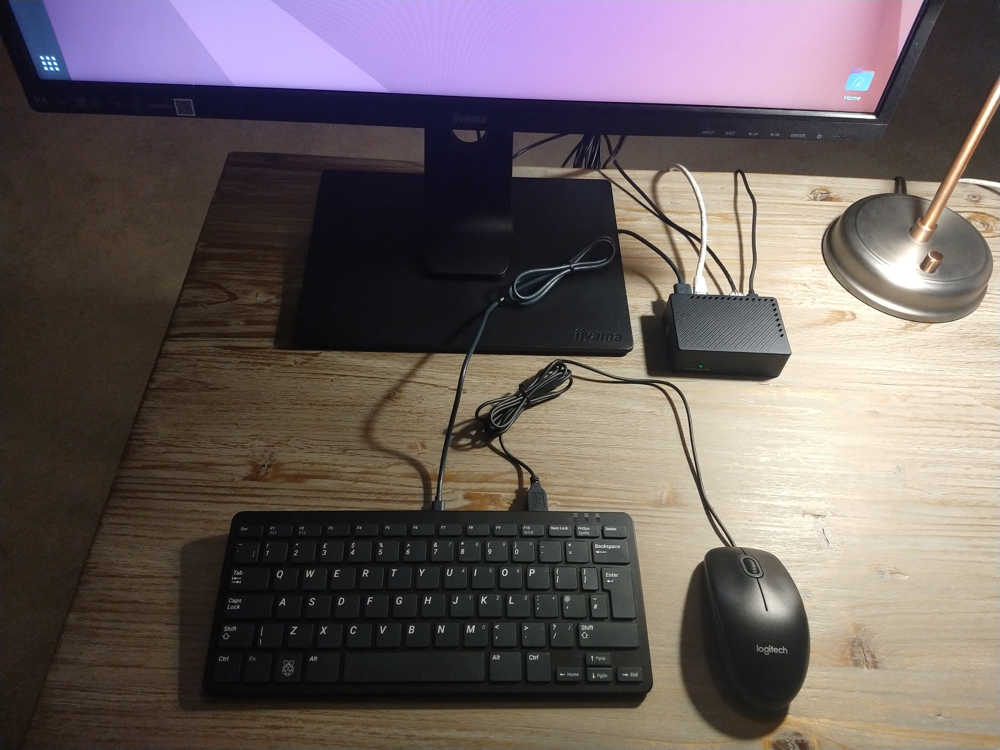
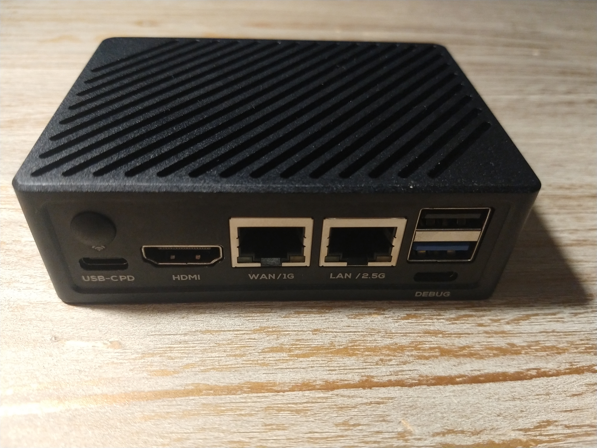
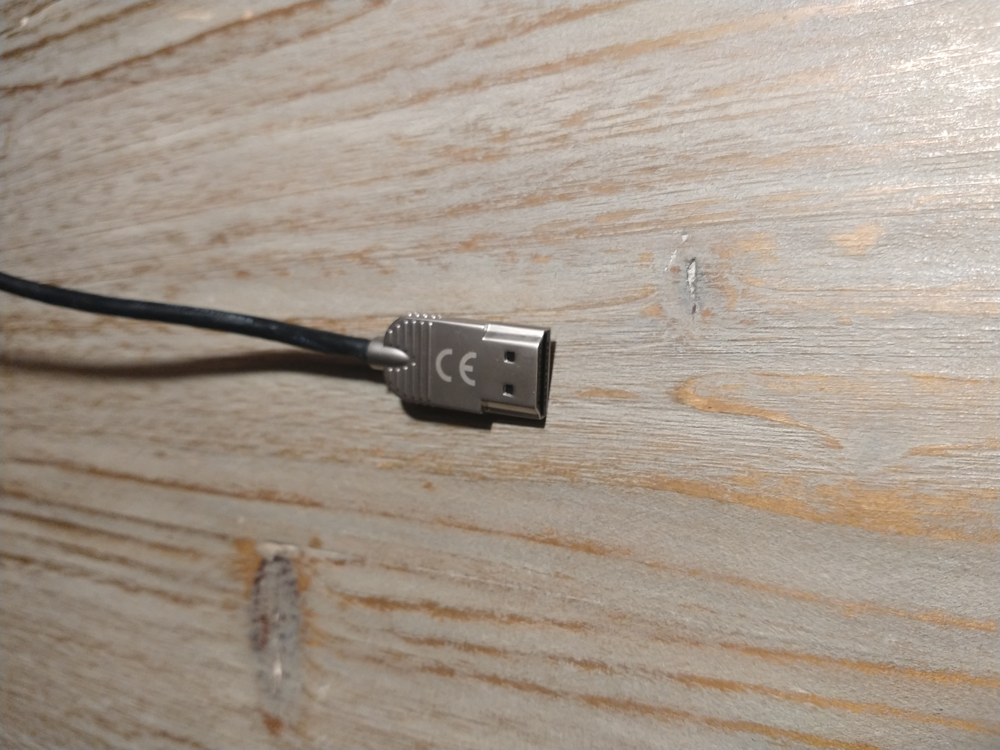
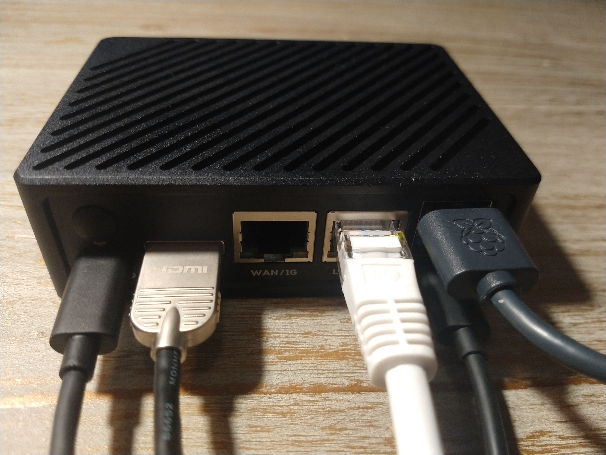

[Back to Index](nanopi.00.index.md)

# 1. Notes

Here is the documentation from the manufacturer:

[NanoPi R6C Product Page](https://www.friendlyelec.com/index.php?route=product/product&product_id=291)

[NanoPi R6C Wiki Page](https://wiki.friendlyelec.com/wiki/index.php/NanoPi_R6C)

## Ports

The HDMI and USB C power ports are too close together.  Existing cables that I had lying around at home, they did not fit well into the back of the device, because the sleeves caused the cables to be too thick for the ports.  I bought a slimline HDMI cable with no sleeve, so that it is no wider than the port.

[Hama 205021 High Speed HDMI Cable Ultra Slim 4K Male to Male Ethernet 2.0 m](https://www.amazon.co.uk/dp/B08SF4K4GG?psc=1&ref=ppx_yo2ov_dt_b_product_details)

Now everything fits.

## Observations

Below are some points that I have noted about the device.  I am new to this and I may have gotten some information wrong, if you see a mistake then please let me know.

### No Upstream Repos

The images (kernel, OS) provided by the manufacturer are disconnected from their sources.  So you do not receive software updates.

The project below provides for the R6C ubuntu images which are connected to the official repositories:

[ubuntu-rockchip](https://github.com/Joshua-Riek/ubuntu-rockchip)

### Unable to Boot from SSD

The device can boot from the microSD card, or from eMMC (which is optional).  There is an NVMe SSD slot, but the device is not capable of booting from SSD.  The best you can do is to install the root partition to the SSD and boot from the eMMC.

### No U-Boot Script

Many devices of this type allow you to create a script which gets loaded by the bootloader to customize the device startup.  The R6C does not support this feature, the manufacturer's fork of U-Boot is not configured to load a boot script.

### Unable to Save U-Boot parameters

Normally from the U-Boot monitor (command prompt) you should be able to save any changes with the command `saveenv`.  This does not work on the R6C, the bootloader was compiled with this feature disabled.  I tried recompiling the bootloader from source with the feature enabled but it still didn't work, I think because the SD image lacks the partition which U-Boot requires to store its state.

