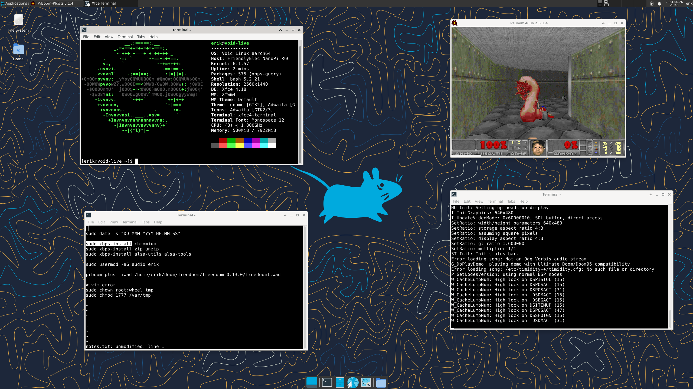

[Back to Index](nanopi.00.index.md)

# 4. Running Void Linux on the NanoPi R6C

This HOWTO describes a procedure for installing
[void linux](https://voidlinux.org/)
to the NanoPi R6C.

## Overview

My setup comprises:
- A laptop running ubuntu
- The R6C with debian installed to the eMMC

We will prepare a microSD card which runs void in a live environment.  We start
with the stock debian installer, overwrite the root filesystem with void, and
then copy in the drivers from the debian environment.

## Get Debian Drivers

We need to grab the drivers from the installed debian system.  I prefer to copy
them from a system which is not running, so I boot the machine from the microSD
and copy the drivers from the installed eMMC system.

    mkdir mnt
    sudo mount /dev/mmcblk2p8 mnt
    cd mnt/lib/modules
    tar czvf drivers.tgz 6.1.57

And copy the tarball to the laptop.

## Set Up Void Root Filesystem

Download the void rootfs arm aarch64 glibc tarball `void-aarch64-ROOTFS-YYYYMMDD.tar.xz` from https://voidlinux.org/download/#arm.

Extract it on the laptop:

    mkdir rootfs
    tar xf void-aarch64-ROOTFS-YYYYMMDD.tar.xz -C rootfs

Get the ip address of the laptop's nameserver (e.g. `127.0.0.53`), we will need that below in order to establish a network connection from within chroot.

    cat /etc/resolv.conf

Now we chroot into the void filesystem and enter the nameserver of the laptop:

    sudo chroot rootfs /bin/bash
    echo 'nameserver 127.0.0.53' | tee -a /etc/resolv.conf

Now proceed with the setup as documented here: https://docs.voidlinux.org/installation/guides/chroot.html

    xbps-install -Su xbps
    xbps-install -u
    xbps-install base-system
    xbps-remove base-container-full
    xbps-install inetutils
    vi /etc/hostname
    vi /etc/rc.conf
    vi /etc/default/libc-locales
    xbps-reconfigure -f glibc-locales
    passwd
    ln -s /etc/sv/dhcpcd /etc/runit/runsvdir/default/
    ln -s /etc/sv/sshd /etc/runit/runsvdir/default/
    xbps-reconfigure -fa

From the laptop, copy the tarball containing the drivers into the filesystem.
From within the chroot session, extract the drivers:

    cd /lib
    mkdir modules
    cd modules
    tar xf /path/to/drivers.tgz

Exit chroot:

    exit

## Prepare the SD Image

From the
[FriendlyElec downloads page](https://download.friendlyelec.com/NanoPiR6C),
download the debian bullseye SD card image e.g.
`rk3588-sd-debian-bullseye-minimal-6.1-arm64-YYYMMDD0.img`

Get the offset (Start) of partition 8 (e.g. 286720):

    fdisk -l rk3588-sd-debian-bullseye-minimal-6.1-arm64-20240620.img

Use that value in the formula below to mount partition 8:

    mkdir mnt
    sudo mount -o loop,offset=$((512*286720)) rk3588-sd-debian-bullseye-minimal-6.1-arm64-YYYMMDD0.img mnt

Zap the old root partition:

    sudo rm -rf mnt/*

Copy in the void root filesystem from above:

    sudo cp -r /path/to/rootfs/* mnt

Unmount:

    sudo umount mnt

Now burn the image to the microSD card.  Power down the nanopi, insert the SD
card, power the device back up, and if all goes well you should be greeted with
a login prompt.

## Setup

Here is an example of a quick setup of the device.

On your first login as root:

Set up the network as documented
[here](https://docs.voidlinux.org/config/network/index.html):

    vi /etc/rc.local

Continue with the setup:

    date -s "DD MMM YYYY HH:MM:SS"
    xbps-install xorg
    xbps-install xfce4
    xbps-install lightdm
    useradd username
    passwd username

Add line `username ALL=(ALL:ALL) ALL`:

    visudo

Chmod the sudo file and reboot:

    chmod 4755 /usr/bin/sudo
    reboot

Now login as `username` and start the desktop environment:

    exec startxfce4

## Updates

This build is connected to the upstream repos for void linux and receives
updates from there.  The kernel and drivers are taken from FriendlyElec and
will not get updated.  I need to find a solution for that.

## Installing to EMMc / NVMe

To install to EMMc, repeat the procedure, replacing the "SD card image" debian from FriendlyElec with the "SD-to-eMMC" image.

The nanopi is not capable of booting from NVMe, but you can copy the root filesystem to NVMe and boot that from EMMc.  The basic procedure would be:
- Build an EMMc image with OverlayFS disabled
- Install to EMMc
- Boot from the microSD card and clone the root partition from EMMc (`/dev/mmcblk2p8`) to NVMe (`/dev/nvme0n1p1`)
- Install to EMMc a customized uBoot which loads root from NVMe

Here is a procedure which does something similar:
[Load Root Partition From SSD](nanopi.03.partition.md)
But it is for ubuntu, and it neglects to disable OverlayFS, I need to update it.

## References

- [Installing Arch Linux AArch64 on the NanoPi R2S](https://gist.github.com/larsch/a8f13faa2163984bb945d02efb897e6d)
- [NanoPi R5S,R5C / RK3568](https://archlinuxarm.org/forum/viewtopic.php?f=67&t=16277)
- [Stock Debian ARM64 Linux for the NanoPi R6C](https://github.com/inindev/nanopi-r6)

